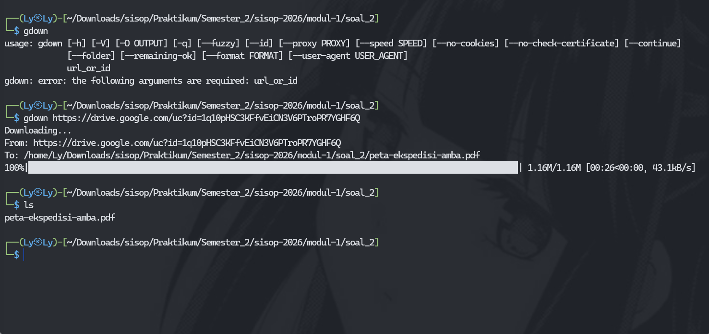
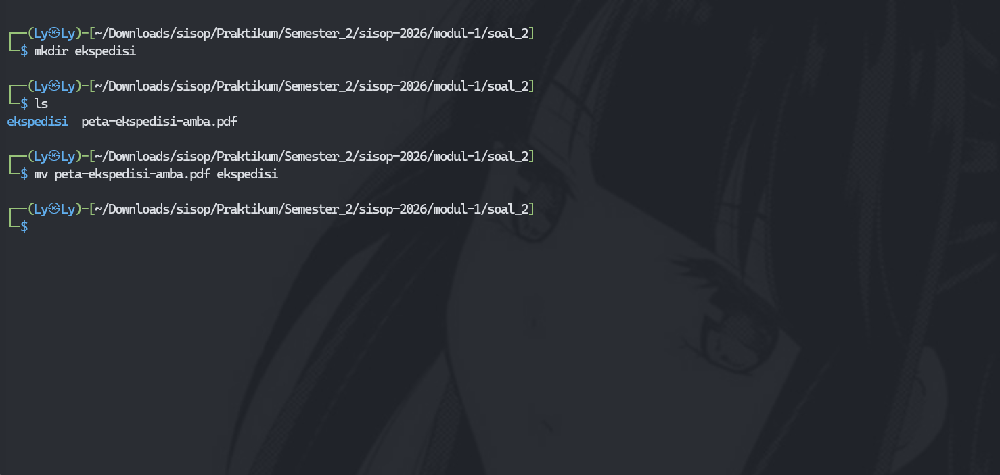
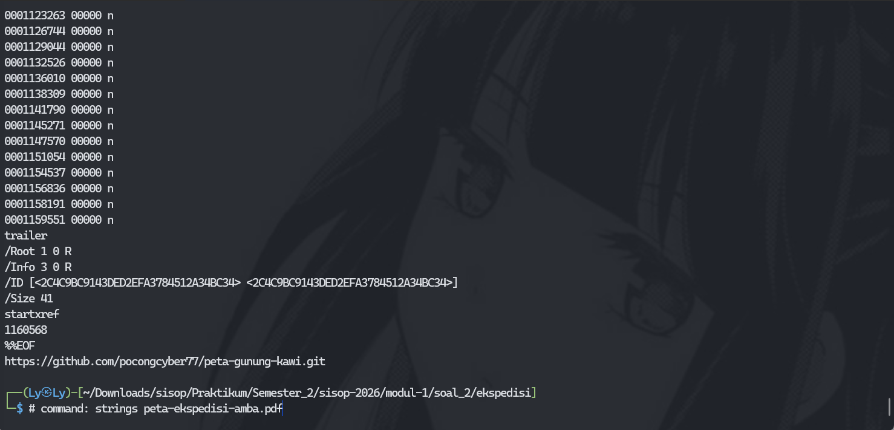
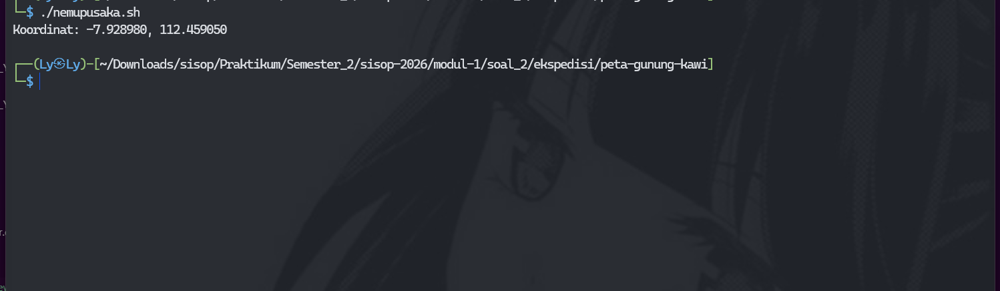
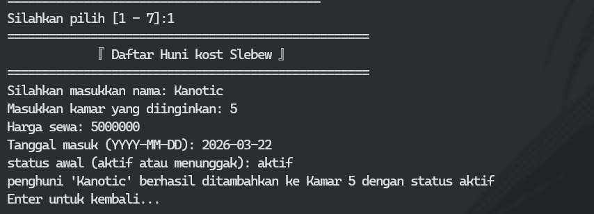
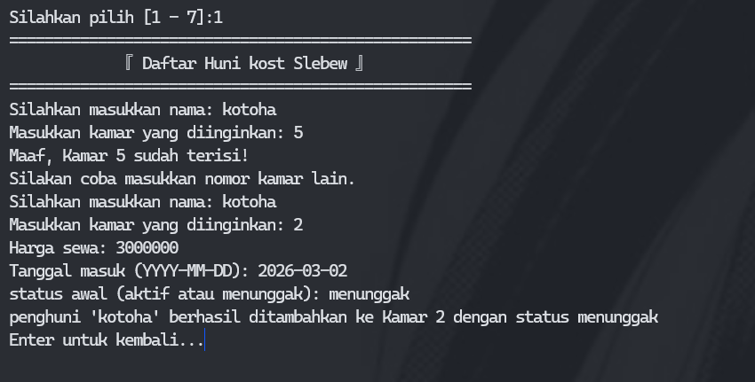
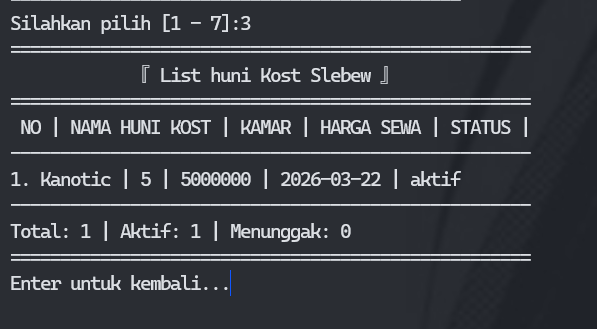
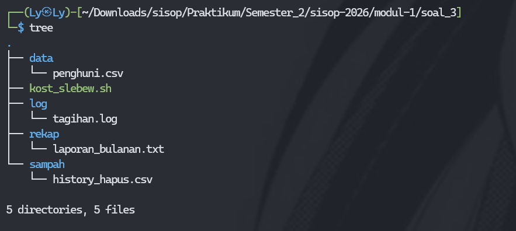

# Sisop-1-2026-IT-107

## Member

| Nama                   | NRP        |
| ---------------------- | ---------- |
| Yovi Prayudya Rizky Ramadhani | 5027251107 |

## Reporting

### Soal 1

#### Penjelasan

**passenger.csv**

untuk langkah pertama, download terlebih dahulu [passenger.csv](https://docs.google.com/spreadsheets/d/1NHmyS6wRO7To7ta-NLOOLHkPS6valvNaX7tawsv1zfE/export?format=csv&gid=0) dengan menggunakan command `wget -O passenger.csv "link passenger.csv"`

Selanjutnya membuat program bernama KANJ.sh

**1. Shell scripting - KANJ.sh - BEGINNING**

```sh
BEGIN {
	FS = ","
	pilihan = tolower(ARGV[2])
	delete ARGV[2]
}
```

Disini adalah awal mulanya. Untuk memulai command biasanya menggunakan `awk -f file_program arg1 arg2` dengan file_program berupa .awk atau .sh (dengan catatan .sh tidak berupa `#!/bin/bash`), arg1 bisa berupa inputan file apapun seperti txt, csv dan arg2 adalah inputan apapun.

**2. Shell scripting - KANJ.sh - MIDDLE**

```sh
{
	if (NR == 1) {
		next
	}

	#removing \r on csv
	sub("\r", "", $0)

	if (pilihan == "a") count_passenger++ 
	if (pilihan == "b") {
		if(!($4 in Gerbong)) {
			carriage++
			Gerbong[$4] = 1
		}
	}
	if (pilihan == "c") {
		if(NR == 2) {
			age = $2
			oldest = $1
		} else if ($2 > age) {
			age = $2
			oldest = $1
		}
	}
	if (pilihan == "d") {
		total += $2
		data++
	}
	if (pilihan == "e") {
		if ($3 == "Business") {
			business_passenger++
		}
	}
}
```

lalu pada bagian ini terdapat beberapa pilihan

```sh
{
	if (NR == 1) {
		next
	}
```

adalah sebuah perintah untuk AWK yang melakukan pengecekan NR terhadap 1 dan dia akan skip bagian itu.

```sh
	#removing \r on csv
	sub("\r", "", $0)
```

bagian ini adalah regex yang melakukan pengecekan terhadap file dan biasanya file tersebut ada `\r` yang disebut sebagai carriage return merupakan barisan yang kembali ke posisi awalnya. kemudian

```sh
	if (pilihan == "a") count_passenger++ 
	if (pilihan == "b") {
		if(!($4 in Gerbong)) {
			carriage++
			Gerbong[$4] = 1
		}
	}
	if (pilihan == "c") {
		if(NR == 2) {
			age = $2
			oldest = $1
		} else if ($2 > age) {
			age = $2
			oldest = $1
		}
	}
	if (pilihan == "d") {
		total += $2
		data++
	}
	if (pilihan == "e") {
		if ($3 == "Business") {
			business_passenger++
		}
	}
}
```

adalah sebuah program if else inputan user. Inputan `a` adalah inputan yang menjumlahkan seluruh penumpang yang ada di csv ini. Inputan `b` adalah inputan yang menjumlahkan gerbong yang ada di csv. Inputan `c` adalah inputan pengecekan dalam csv yang tertua. Inputan `d` adalah inputan untuk mengetahui jumlah seluruh umur penumpang dalam csv. Dan yang terakhir inputan `e` adalah inputan program yang ingin memeriksa total penumpang Business class ini

**3. Shell scripting - KANJ.sh - END**

```sh
END {
	switch (pilihan) {
		case "a":
		print "Jumlah seluruh penumpang KANJ adalah " count_passenger " orang"
		break
		case "b":
		if (carriage == "") {
			print "Jumlah gerbong penumpang KANJ adalah 0"
			
		} else {
			print "Jumlah gerbong penumpang KANJ adalah " carriage
		}
		break

		case "c":
		print oldest " adalah penumpang kereta tertua dengan usia " age " tahun"
		break

		case "d":
		if (data > 0) {
			average_age = total / data
			printf "Rata-rata usia penumpang adalah %.0f tahun", average_age
		}
		break

		case "e":
		if (business_passenger == "") business_passenger = 0
		print "Jumlah penumpang business class ada " business_passenger " orang"
		break

		default:
		print "Soal tidak dikenali. Gunakan a, b, c, d, atau e. \nContoh penggunaan: awk -f file.sh data.csv a"
		break
	}
}
```

Ini adalah program terakhir dari shell script ini. Bisa dibilang outputan program ini dan sedikit menambahkan untuk opsi `d` itu adalah average atau rata-rata umur dari seluruh penumpang dalam csv ini

#### Output

1. Mengunduh file passenger.csv


2. Output dari pilihan a


3. Output dari pilihan b


4. Output dari pilihan c


5. Output dari pilihan d


6. Output dari pilihan e


7. Output dari selain pilihan a, b, c, d, e


#### Kendala

Tidak ada kendala

### Soal 2

**Dikerjakan secara: individu**

#### Penjelasan

**a. Mengunduh file peta-ekspedisi-mamba.pdf**

Langkah pertama yaitu menyiapkan tools `gdown` untuk mendownload sebuah pdf. Lalu menggunakan command `gdown https://drive.google.com/uc?id=1q10pHSC3KFfvEiCN3V6PTroPR7YGHF6Q`

**b. Membuat sebuah folder ekspedisi dan memindahkan ke dalam folder ekspedisi**

Langka kedua menggunakan command `mv peta-ekspedisi-mamba.pdf ekspedisi` untuk memindahkannya ke dalam folder ekspedisi

**c. Menggunakan strings untuk mengetahui metadata pdf file**

Langkah ketiga menggunakan command `strings peta-ekspedisi-mamba.pdf` untuk mengetahui rahasia dalam file pdf ini yang berupa sebuah link github.

**d. Menggunakan git clone**

Langkah keempat menggunakan command `git clone https://github.com/pocongcyber77/peta-gunung-kawi.git` untuk clone berupa `gsxtrack.json`

**e. mengurutkan id, site_name, latitude, dan longitude**

Langkah kelima membuat sebuah program bernama `parserkoordinat.sh` yang berisi programnya:

```sh
#!/bin/bash

echo "haik, wakarimasta. Lagi process membaca gsxtrack.json dan dipindah ke titik-penting.txt"

jq -r '.features[] | "\(.id), \(.properties.site_name), \(.properties.latitude), \(.properties.longitude)"' gsxtrack.json > titik-penting.txt

echo "Kelar wak. udh selesai dipindah ke titik-penting.txt"
```

Inti dari program ini adalah mengambil id, site_name, latitude, dan longitude yang ada dalam `features` dan dipindahkan ke `titik-penting.txt` untuk diurutkan.

**f. Membuat titik pusat metode titik simetri diagonal**

Langkah keenam membuat program `nemupusaka.sh` yang programnya:

```sh
#!/bin/bash

file="titik-penting.txt"

awk -F', ' '
BEGIN {
}
NR==1 {
    lat_min=lat_max=$3
    lon_min=lon_max=$4
}
{
    if ($3 < lat_min) lat_min = $3
    if ($3 > lat_max) lat_max = $3
    if ($4 < lon_min) lon_min = $4
    if ($4 > lon_max) lon_max = $4
}
END {
    pusat_lat = (lat_min + lat_max) / 2
    pusat_lon = (lon_min + lon_max) / 2
    
    printf "Koordinat: "
    printf "%.6f, %.6f\n", pusat_lat, pusat_lon
    printf "Koordinat: %.6f, %.6f\n", pusat_lat, pusat_lon > "posisipusaka.txt"
}' "$file"
```

Yang isi dari program ini adalah membandingkan maximum dan minimum longitude dan latitude dari masing-masing yang ada di file `titik-penting.txt`

```sh
{
    if ($3 < lat_min) lat_min = $3
    if ($3 > lat_max) lat_max = $3
    if ($4 < lon_min) lon_min = $4
    if ($4 > lon_max) lon_max = $4
}
```

adalah program mencari latitude maximum, latitude minimum, longitude minimum, dan longitude maximum. Karena program menggunakan awk, jadinya program tersebut akan terus berjalan sampai akhir

```sh
END {
    pusat_lat = (lat_min + lat_max) / 2
    pusat_lon = (lon_min + lon_max) / 2
    
    printf "Koordinat: "
    printf "%.6f, %.6f\n", pusat_lat, pusat_lon
    printf "Koordinat: %.6f, %.6f\n", pusat_lat, pusat_lon > "posisipusaka.txt"
}' "$file"
```

dan yang terakhir adalah program mencari titk koordinatnya dan mengeluarkan output x, y.

#### Output

1. Mengunduh file peta-ekspedisi-mamba.pdf
   




2. Membuat sebuah folder ekspedisi dan memindahkan ke dalam folder ekspedisi
   


3. Menggunakan strings untuk mengetahui metadata pdf file



4. Menggunakan git clone


5. mengurutkan id, site_name, latitude, dan longitude



6. Membuat titik pusat metode titik simetri diagonal

   

#### Kendala

Tidak ada kendala

### Soal 3

#### Penjelasan

**Shell scripting - Kost Slebew**

Pertama untuk tambah penghuni dari sebuah kost, bisa memanfaatkan looping sederhana dan melakukan validasi dari tiap input user dalam nama, kamar, status, dan data-data dari input user akan dimasukkan ke dalam sebuah file `data/penghuni.csv`

```c
create() {

    echo "==================================================== "
    echo "             『Daftar Huni kost Slebew 』            "
    echo "==================================================== "

    while true; do
    read -p "Silahkan masukkan nama: " nama
    if grep -q -w "$nama" data/penghuni.csv 2>/dev/null; then
        echo "Maaf, Penghuni dengan nama '$nama' sudah terdaftar!"
        echo "Silakan coba masukkan nama lain."
        continue
    fi

    read -p "Masukkan kamar yang diinginkan: " kamar
    if [[ $kamar =~ $re ]] ; then
        if grep -q -w "$kamar" data/penghuni.csv 2>/dev/null; then
            echo "Maaf, Kamar $kamar sudah terisi!"
            echo "Silakan coba masukkan nomor kamar lain."
            continue
        fi
    else
        echo "maaf harus input angka"
        sleep 1
        continue
    fi
    read -p "Harga sewa: " price
    read -p "Tanggal masuk (YYYY-MM-DD): " date
    read -p "status awal (aktif atau menunggak): " status
    if [[ "$status" == "aktif" || "$status" == "menunggak" ]]; then
          echo "$nama,$kamar,$price,$date,$status" >> data/penghuni.csv

            echo "penghuni '$nama' berhasil ditambahkan ke Kamar $kamar dengan status $status "

            while true; do
                read -p "Enter untuk kembali..." dummy
                if [ "$dummy" != "" ]; then
                    echo "Nope, harus enter"
                else
                    break   
                fi
            done
        return
    else
          echo "Harus ketik aktif atau menunggak yakk"
          continue
     fi
done
}
```

Sebelum melanjutkan, terdapat pembuatan awal folder dan file menjadi 1 dan menggunakan cd untuk menuju ke file `kost_slebew.sh`. Dan juga terdapat global regex yang mewajibkan pengguna untuk input hanya berupa angka

pembuata folder dan file penghuni.csv

```sh
cd "$(dirname "$0")" 
mkdir -p data log rekap sampah 
if [ ! -f data/penghuni.csv ]; then
    echo "Nama,Kamar,Harga,Tanggal,Status" > data/penghuni.csv
fi
```

regex global berupa angka

```sh
re='^[0-9]+$'
```

Setelah itu ada function `delete` untuk menghapus data penghuni dari kos yang sesuai diminta sama soal dan untuk menghapusnya hanya lewat nama dari penghuni itu serta history penghapusannya dipindah dengan mengcopy dari file utama ke file `history_hapus.csv`ini. Dan untuk penghapusannya hanya di file `history_hapus.csv` bukan di utamanya.

```sh
delete() {

    echo "==================================================== "
    echo "           『Delete Huni Kost Slebew 』              "
    echo "==================================================== "

    cp data/penghuni.csv sampah/history_hapus.csv
    read -p "Masukkan nama penghuni yang ingin dihapus: " nama

    if grep -q -w "$nama" sampah/history_hapus.csv 2>/dev/null; then
        sed -i "/^$nama,/d" sampah/history_hapus.csv
        echo "Penghuni '$nama' berhasil dihapus."
    else
        echo "Penghuni '$nama' tidak ditemukan."
    fi

     while true; do
          read -p "Enter untuk kembali..." dummy
          if [ "$dummy" != "" ]; then
               echo "Nope, harus enter"

               else
                    break   
          fi
    done

    return
}
```

Selanjutnya program diminta untuk melakukan list penghuni

```sh
list_huni() {
    echo "==================================================== "
    echo "             『List huni Kost Slebew 』              "
    echo "==================================================== "
    echo " NO | NAMA HUNI KOST | KAMAR | HARGA SEWA | STATUS | "
    echo "---------------------------------------------------- "

    awk -F',' '
    BEGIN { 
        aktif = 0
        nunggak = 0
        no = 1 
    }
    NR > 1 { 
        
        if ($5 == "aktif") aktif++
        if ($5 == "menunggak") nunggak++
        
        tampilan = $0
        gsub(/,/, " | ", tampilan)
        
        print no ". " tampilan
        print "---------------------------------------------------- "
        no++
    }
    END {

        total = no - 1
        print "Total: " total " | Aktif: " aktif " | Menunggak: " nunggak
    }' data/penghuni.csv 2>/dev/null

    echo "==================================================== "
    read -p "Enter untuk kembali..." dummy
    return
}
```

Pada function ini, saya menggunakan awk untuk melakukan suatu perulangan untuk membaca `penghuni.csv` dengan sebuah kondisi dimana yang menunggak sendiri dan yang aktif sendiri, tidak digabung menjadi 1.

```sh
update_huni() {

    echo "==================================================== "
    echo "             『Update Huni Kost Slebew 』            "
    echo "==================================================== "
    read -p "Masukkan nama penghuni yang ingin diubah statusnya: " nama

        if grep -q -w "$nama" data/penghuni.csv 2>/dev/null; then
            read -p "Masukkan status Baru (Aktif atau nunggak): " stat_bar
            sed -i "s/^\($nama,[^,]*,[^,]*,[^,]*\),.*/\1,$stat_bar/" data/penghuni.csv
            echo "Penghuni '$nama' berhasil diganti menjadi $stat_bar"
        else
            echo "Penghuni '$nama' tidak ditemukan."
        fi
}
```

Dalam program ini, akan mengubah suatu status berdasarkan nama yang diketik dan status terbaru. Misalkan `Kano` dengan status lama `menunggak`, user akan menginput nama `Kano` dan mengubah status lamanya menjadi `aktif`. Begitupun sebaliknya dan data ini akan tersimpan dalam file `penghuni.csv`. Disini juga pemakaian `sed` dipakai untuk mengubah statusnya tersebut ke dalam file `penghuni.csv` dengan status barunya dan mungkin beberapa function yang lain juga menggunakan `sed` untuk mengubah suatu data dalam file itu seperti dalam `delete` function.

```sh
laporan() {
    rekap=$(awk -F',' '
    BEGIN {
        pendapatan = 0
        pendapatan_nung = 0
        jml_nunggak = 0
        list_nunggak = ""
    }
    NR > 1 { 
        
        if ($5 == "aktif") {
            pendapatan += $3
        } 
        else if ($5 == "menunggak") {
            pendapatan_nung += $3
            jml_nunggak++
            list_nunggak = list_nunggak $1 ", "
        }
    }
    END {

        if (list_nunggak != "") {
            sub(/, $/, "", list_nunggak)
        } else {
            list_nunggak = "-"
        }

        print "===================================================="
        print "          『 Laporan huni Kost Slebew 』            "
        print "===================================================="
        print "Total Pendapatan Aktif : Rp " pendapatan
        print "Total tunggakan        : RP " pendapatan_nung
        print "Jumlah Orang Nunggak   : " jml_nunggak
        print "Daftar Nama Nunggak    : " list_nunggak
        print "===================================================="
    }' data/penghuni.csv 2>/dev/null)

    echo "$rekap"
    
    echo "$rekap" > rekap/laporan_bulanan.txt
    echo "Hasil rekapan sudah dimasukkan ke dalam rekap/laporan_bulanan.txt"
    
    read -p "Enter untuk kembali..." dummy
}
```

Pada function `laporan` disini juga saya menggunakan awk untuk melakukan suatu perulangan dalam membaca sebua file `penghuni.csv` untuk merekap hasil pendapatannya dengan kondisi aktif tersendiri dan menunggak tersendiri. Selanjutnya dari data rekapan tersebut, akan disimpan ke sebuah file `laporan_bulanan.txt` dengan menggunakan teknik `overwrite` 

```sh
pengingat() {
    while true; do
        echo "==================================================== "
        echo "                  『 Menu Kron 』                   "
        echo "==================================================== "
        echo "1. Lihat Jadwal Aktif (System)"
        echo "2. Tambah Jadwal Baru"
        echo "3. Hapus Semua Jadwal"
        echo "4. Kembali"
        echo "==================================================== "
        read -p "Pilih 1-4: " pilih

        if [ "$pilih" == "1" ]; then
            echo "--- List Cron yang sedang berjalan ---"
            crontab -l 2>/dev/null || echo "Belum ada jadwal aktif."
            
        elif [ "$pilih" == "2" ]; then
            echo "Format: menit jam tgl bulan hari_minggu"
            read -p "Input jadwal (contoh: 00 23 * * *): " jadwal
            read -p "Perintah/Script yg dijalankan (path lengkap): " cmd
            
            (crontab -l 2>/dev/null; echo "$jadwal $cmd") | crontab -
            
            echo "Jadwal berhasil diaktifkan!"
            echo "[$(date)] Berhasil input: $jadwal $cmd" > log/tagihan.log

        elif [ "$pilih" == "3" ]; then

            crontab -r
            echo "Semua jadwal cron telah dihapus!"
            echo "[$(date)] Menghapus semua cron" >> log/tagihan.log

        elif [ "$pilih" == "4" ]; then
            break 
        else
            echo "pilihan salah. coba lagi"
        fi

        read -p "Enter untuk kembali..." dummy
                if [ "$dummy" != "" ]; then
                    echo "Nope, harus enter"
                else
                    break   
                fi
    done
}
```

Dan disinilah function terakhir yaitu `pengingat` dengan melakukan teknik `crob`. Dalam function ini, ada perulangan sederhana menggunakan while dan memiliki beberapa pilihan

```sh
if [ "$pilih" == "1" ]; then
            echo "--- List Cron yang sedang berjalan ---"
            crontab -l 2>/dev/null || echo "Belum ada jadwal aktif."
```

Jika pilihannya 1 maka pilihan ini akan menjalankan list yang sudah dibuat oleh user ataupun masih belum ada

```sh
        elif [ "$pilih" == "2" ]; then
            echo "Format: menit jam tgl bulan hari_minggu"
            read -p "Input jadwal (contoh: 00 23 * * *): " jadwal
            read -p "Perintah/Script yg dijalankan (path lengkap): " cmd
            
            (crontab -l 2>/dev/null; echo "$jadwal $cmd") | crontab -
            
            echo "Jadwal berhasil diaktifkan!"
            echo "[$(date)] Berhasil input: $jadwal $cmd" >> log/tagihan.log
```

Jika pilihan 2 maka user harus menginput sesuai dengan aturan cron yaitu `*` pertama untuk menit `*` kedua untuk jam, `*` untuk hari dalam bulan, `*` bulan, dan yang terakhir untuk hari dalam minggu dan untuk inputan ini harus lengkap. jika hanya jam saja maka `00 07 * * *`. Selanjutnya adalah path menuju sebuah program `kosh_slebew.sh`. Untuk pathnya sendiri harus lengkap. Dan jika user sudah input sesuai 2 kategori data, maka inputan ini akan masuk ke dalam file `tagihan.log`.

```sh
        elif [ "$pilih" == "3" ]; then

            crontab -r
            echo "Semua jadwal cron telah dihapus!"
            echo "[$(date)] Menghapus semua cron" >> log/tagihan.log
```

Jika inputan angka 3, program ini akan menjalan penghapusan cron yang sudah dibuat oleh pengguna dan akan menghapus yang sudah jalan di dalam file `tagihan.log`

```sh
elif [ "$pilih" == "4" ]; then
            break 
        else
            echo "pilihan salah. coba lagi"
        fi

        read -p "Enter untuk kembali..." dummy
                if [ "$dummy" != "" ]; then
                    echo "Nope, harus enter"
                else
                    break   
                fi
    done
```

Pilihan terakhir yaitu keluar dari menu cron itu sendiri

```sh
while true
do
cat << "EOF"

 __                  __           .__        ___.                  
|  | ______  _______/  |_    _____|  |   ____\_ |__   ______  _  __
|  |/ /  _ \/  ___/\   __\  /  ___/  | _/ __ \| __ \_/ __ \ \/ \/ /
|    <  <_> )___ \  |  |    \___ \|  |_\  ___/| \_\ \  ___/\     / 
|__|_ \____/____  > |__|   /____  >____/\___  >___  /\___  >\/\_/  
     \/         \/              \/          \/    \/     \/        

EOF

echo "============================================="
echo "      『SISTEM MANAJEMEN KOST SLEBEW 』      "
echo "============================================="
echo " ID | OPTION "
echo "---------------------------------------------"
echo " 1 | Menambahkan penghuni baru ke daftar "
echo " 2 | Menghapus penghuni dari daftar "
echo " 3 | Menampilkan daftar penghuni "
echo " 4 | Update status penghuni " 
echo " 5 | Cetak laporan keuangan "
echo " 6 | Kelola Cron (pengingat tagihan) "
echo " 7 | Exit "
echo "============================================="
read -p "Silahkan pilih [1 - 7]:" opt

    if [[ $opt =~ $re ]] ; then
        if [ "$opt" == "7" ]; then
            exit 0
        elif [ "$opt" == "1" ]; then
            create
        elif [ "$opt" == "2" ]; then
            delete
        elif [ "$opt" == "3" ]; then
            list_huni
        elif [ "$opt" == "4" ]; then
            update_huni
        elif [ "$opt" == "5" ]; then
            laporan
        elif [ "$opt" == "6" ]; then
            pengingat
        else 
            echo "Harus memilih angka 1 - 7 yak!"
            sleep 1
            continue
        fi
    else 
    echo "Harus masukin angka :<"
    sleep 1
    continue
    fi
done
```

Terdapat pilihan menu untuk sebuah user yang bisa pilih dari no 1 sampai 7 dan memiliki handler masing-masing kecuali no 7 yaitu program yang keluar dari perulangan dan mematikan program

#### Output

1. Awalnya tidak ada file dan folder


2. Tambah huni



3. Tambah huni kedua dengan sanitasi



4. Hapus huni


5. List huni (sebelum kanotic dihapus dan belum menambahkan kotoha)



6. Laporan keuangan


7. Update status huni


8. Menambah cron


9. List cron


10. Menghapus cron


11. Finalisasi



#### Kendala

Terdapat kendala cron itu sendiri yang dimana harus mengikuti aturan dan tidak ada penambahan setelah path dari sebuah program itu berjalan. Penggunaan sed itu sendiri yang mengakibatkan beberapa pencarian dalam internet mengenai `sed` untuk mengubah status